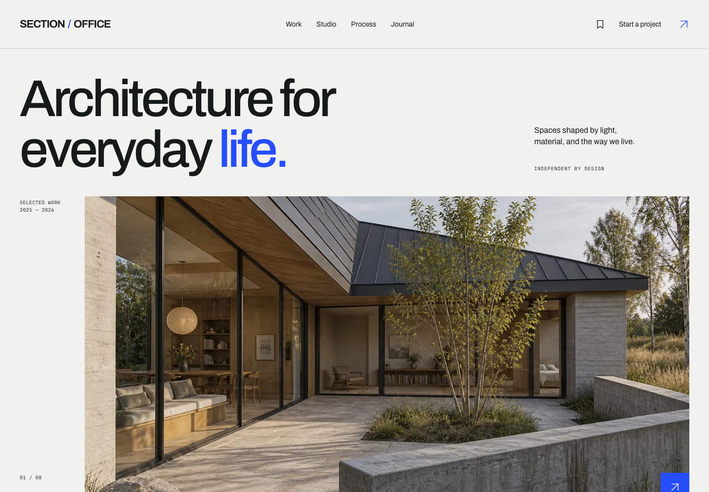
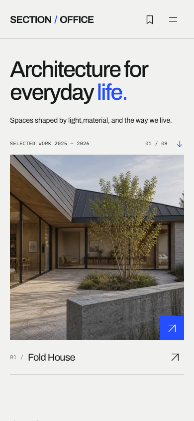

# SECTION / OFFICE

A self-initiated architecture and interiors portfolio concept. Eight original fictional studies, 30 generated architectural visualizations and an editorial identity built around cool paper, bold Archivo typography and signal blue.

The site is a Next.js static export. **There is no database, application backend, real email delivery, authentication, tracking or required API key.**

## Run locally

Use Node.js 22.18 or newer and npm. Dependencies are pinned; `npm ci` reproduces the lockfile.

```sh
npm ci
npm run dev
```

Development preview: [http://localhost:3000](http://localhost:3000/).

To build and serve the actual static export, stop the development server first:

```sh
npm run build
npm run start
```

Static preview: [http://localhost:3000](http://localhost:3000/). `npm run start` serves `out/`, including nested directory indexes and the 404 response. To run it beside the development server, use `PORT=3001 npm run start`; local records are separate at that different origin.

```sh
npm run typecheck
npm run lint
npm test
npm run verify:export
npm run test:browser
```

Browser checks require an installed Playwright Chromium browser. Install it once if needed with `npx playwright install chromium`. Run them against the static server. Tests use separate temporary browser contexts and sample details; they do not reset the user’s open preview profile.

## What is implemented

- Homepage with three flagship narratives, varied photographic compositions, material sequence, further-work index and journal.
- Eight complete case studies with facts, original copy, related studies, accessible lightboxes, saved references and clean project sharing. Three flagship SVG schematics.
- Project index with URL category/search state, result count, reset/no-results, image grid and compact list; preferred view persists locally.
- Studio, practical four-stage process, three original journal articles, privacy and useful 404.
- Browser-local saved projects, a five-step project brief with inline validation, automatic draft recovery, final review and duplicate-safe local submission.
- My brief: edit drafts, review submitted records, delete, print or download an actual text summary.
- Contact inquiry demo, sample-data entry, scoped reset and openly accessible local studio inbox with search, status and notes.
- Thirteen designed raster covers: homepage, eight projects, three articles and branded fallback. Complete build-time canonical/Open Graph/Twitter metadata.

## Short demo walkthrough

1. Open [Work](http://localhost:3000/work/), select a category and switch between grid and list.
2. Open Fold House. Use the gallery, save the project, and copy its public page link.
3. Open Saved references and carry the selection into a brief. “Use sample details” fills non-sensitive example data.
4. Change the context, save/refresh, continue through the steps and review. Confirm the local-demo statement, then save the brief.
5. Open My brief to review, download or print it. Open `/demo/inbox/` and set the status to Reviewing; it updates in the visitor view and other same-origin tabs.
6. `/demo/` adds one idempotent sample record or resets only SECTION OFFICE’s namespaced local data after confirmation.

## Local data

One key, `section-office:demo:v1`, stores IDs, view preference, drafts, submitted briefs, inquiries, statuses and notes. No images are stored there. Data belongs to this browser profile and origin; it does not move across browsers/devices. Clearing site data removes it. Browser state is editable and offers no authentication boundary.

Corrupt, full or disabled storage is handled explicitly. Failed writes do not report persistent success. An optional temporary session loses changes at refresh/close. The inbox is a public local UI demonstration, not a protected admin product. Sharing `/saved/` or a local record URL does not transmit its contents.

## Screenshots and share assets

Portfolio screenshots are in `docs/screenshots/`:

- `home-desktop.png`, `home-mobile.png`: full homepage.
- `home-desktop-opening.png`, `home-mobile-opening.png`: first viewport.
- `fold-house-desktop.png`, `fold-house-mobile.png`: case study.
- `work-desktop.png`, `work-mobile.png`, `work-list-desktop.png`: index views.
- `studio-desktop.png`, `studio-mobile.png`, `brief-review-desktop.png`, `inbox-desktop.png`.
- `home-user-509-opening.png`: the actual observed in-app preview width.




Covers: `public/social/home-v1.jpg`, `fold-house-v1.jpg`, `foundry-hall-v1.jpg` and the full manifest in `public/social/manifest.json`. Thumbnail and centered-square inspection files live in `docs/screenshots/covers/`.

## Deploying and configuring link previews

No external deployment has been performed or authorized. The current export uses `http://localhost:3000` for local verification. It is not a publicly fetchable share-ready origin.

After a static host has assigned the actual HTTPS origin, rebuild using that origin. Replace the quoted value below with the real deployment address; it is intentionally not a registered domain supplied by this project.

```sh
SITE_URL='https://YOUR-ACTUAL-DEPLOYMENT-HOST' npm run build
SITE_URL='https://YOUR-ACTUAL-DEPLOYMENT-HOST' npm run verify:export
```

Upload only `out/` to a static host that serves `route/index.html`, correct MIME types and `404.html` for unknown routes. No Next.js runtime or image optimizer is needed. Do not enable authentication or crawler-blocking protection if external previews are required. Pages use `noindex, follow`; robots.txt allows fetching.

Verify the deployed homepage, each project page and `/social/*-v1.jpg` over HTTPS with successful responses and correct content types. Inspect the deployed HTML’s canonical/OG/Twitter origins. Then use applicable platform preview/debug tools on representative links. **Social images and exported metadata are verified locally; no publicly deployed URL or real platform unfurl is claimed.** See [SOCIAL-PREVIEWS.md](docs/SOCIAL-PREVIEWS.md) for exact checks and caching limits.

## Project documents

Read `AGENTS.md`, `PRODUCT.md`, `DESIGN.md`, then `docs/STATUS.md` before continuing. Architecture, provenance, preview evidence and QA are in `docs/`. [Portfolio case-study draft](docs/PORTFOLIO-CASE-STUDY.md) contains factual design/implementation copy with no invented client results.
